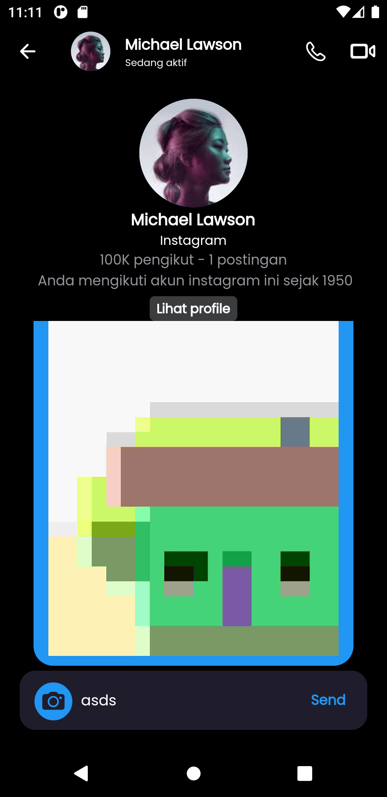
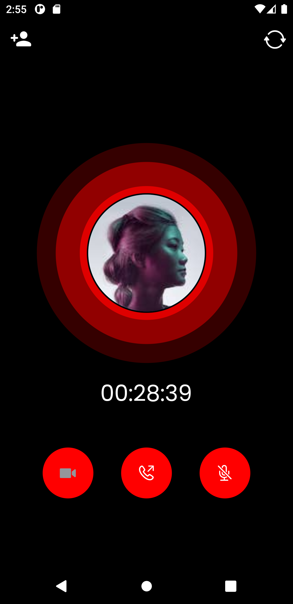
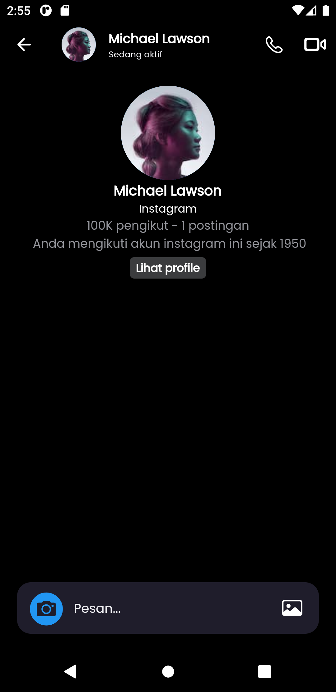
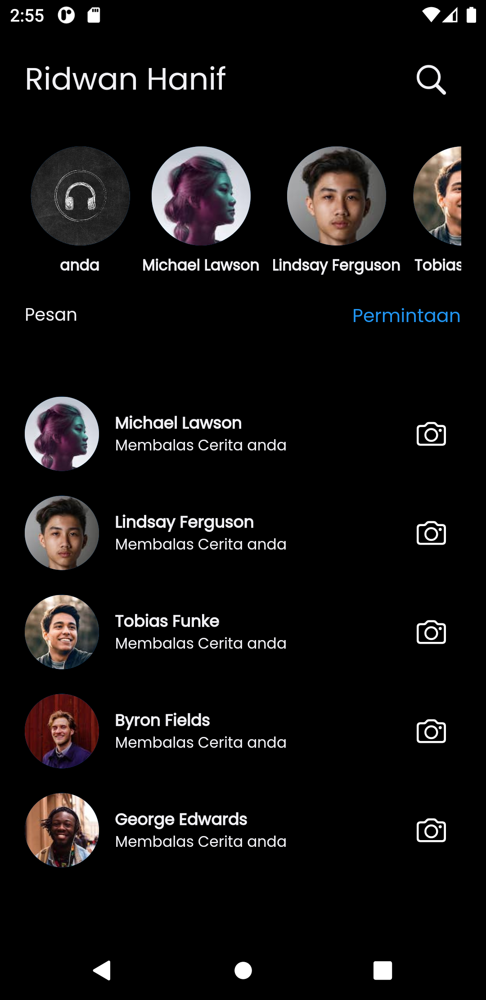

# chat_instagram_ui

## ui clonning chat instagram

    

```
chat_instagram_ui

├─ lib
   ├─ controllers
   │  ├─ chat.dart
   │  └─ dummy.dart
   ├─ firebase_options.dart
   ├─ main.dart
   ├─ models
   │  ├─ dummy_model.dart
   │  ├─ message.dart
   │  ├─ models.dart
   │  └─ sender.dart
   ├─ theme.dart
   └─ views
      ├─ screens
      │  ├─ calling_page.dart
      │  ├─ chats_page.dart
      │  ├─ home_page.dart
      │  ├─ login_page.dart
      │  └─ register_page.dart
      └─ widgets
         ├─ animation.dart
         ├─ camera.dart
         ├─ page_transition.dart
         ├─ shimmer.dart
         ├─ splash.dart
         ├─ take_photo.dart
         └─ textfield.dart

```
